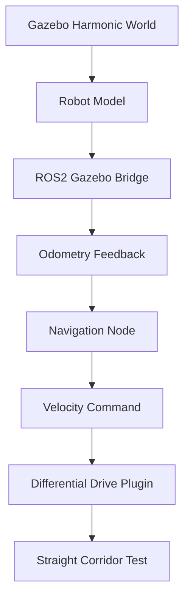

# Autonomous Navigation Simulation (Gazebo)

## Overview

A Gazebo-based autonomous navigation simulation built to develop, evaluate and benchmark autonomous robot navigation within structured simulation environments. The project incrementally expands from fundamental navigation scenarios to increasingly complex environments while emphasizing reproducible development, modular system design and performance evaluation.

The simulation utilizes ROS 2, Gazebo Harmonic and a custom differential drive robot to develop autonomous navigation behaviors that will ultimately be validated across multiple navigation scenarios using quantitative performance metrics. The final project will provide a Dockerized, reproducible simulation environment suitable for experimentation, parameter tuning and navigation benchmarking.

## Latest Release: v0.1 
**Straight Corridor**

Version 0.1 establishes the simulation foundation by spawning a mobile robot in a cone-defined straight corridor and verifying baseline navigation behavior before adding more complex navigation.

**Key Features:**

- Gazebo world setup
- Robot spawning
- Straight corridor test environment
- Baseline forward navigation
- Initial visual documentation

## Demo

  

  <em>Figure 1. Straight corridor simulation environment demonstrating baseline autonomous navigation..</em>

## Features

- Created a custom Gazebo Harmonic straight corridor environment with orange traffic cones.
- Spawned a custom differential drive robot inside the test environment.
- Implemented odometry distance tracking for accurate stopping.
- Verified baseline movement through the corridor.
- Captured initial simulation screenshot/video for documentation.

## Test Environment

The straight corridor test case is designed to evaluate whether the robot can maintain stable forward motion through a constrained path without contacting the cone boundaries.

## Scenario Details

| Field             | Description                                                                      |
| ----------------- | -------------------------------------------------------------------------------- |
| Scenario          | Straight Corridor                                                                |
| Environment       | Gazebo Harmonic simulation                                                       |
| Obstacle Type     | Cone-defined corridor (orange traffic cones, 0.15m radius, 0.5m height)         |
| Robot Model       | Custom differential drive robot (0.4m x 0.3m x 0.1m body, 0.08m wheel radius)  |
| Navigation Method | Scripted motion via odometry-based distance tracking                             |
| Sensor Setup      | 2D LiDAR (360°, 10Hz, 0.12–10m range), wheel odometry                           |
| Goal Condition    | Robot reaches the end of the corridor without collision                          |

## System Architecture

## Tech Stack

- Gazebo Harmonic
- ROS 2 Jazzy
- C++
- URDF

## Version History
- **v0.1:** Straight Corridor    

## Roadmap         
- **v0.2:** Turn Navigation                
- **v0.3:** Roundabout Navigation         
- **v0.4:** Dead-end and Recovery           
- **v0.5:** Validation Benchmarking
- **v1.0:** Dockerized Reproducible Release           

## Author

Lucas Kwan