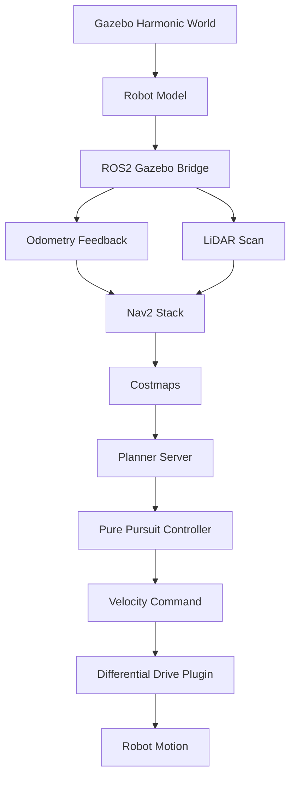

# Autonomous Navigation Simulation (Gazebo)

## Overview

A ROS 2 and Gazebo Harmonic autonomous navigation simulation for developing and evaluating Navigation2 performance across progressively more challenging environments. The project incrementally expands from baseline navigation to sustained curved trajectories while emphasizing reproducible experimentation, modular system design, and quantitative performance evaluation.

## Latest Update: v1.0
**Dockerized Reproducible Release**

Version 1.0 packages the full simulation environment into a Docker container, enabling reproducible execution of all navigation scenarios without requiring a local ROS 2 or Gazebo installation. The container includes all dependencies, build artifacts and launch configurations required to run any scenario out of the box.

**Added Features:**
- Full Docker containerization with Nvidia GPU passthrough support
- X11 display forwarding for Gazebo and RViz2 GUI access
- Single-command build and launch workflow
- Self-contained environment reproducible across Linux systems

## Demo

<p align="center">
  
</p>

<p align="center">
  <em>Figure 1. Straight corridor simulation environment demonstrating baseline autonomous navigation.</em>
</p>

<p align="center">
  
</p>

<p align="center">
  <em>Figure 2. Turn navigation simulation environment demonstrating autonomous Nav2 guided navigation through a curved corridor.</em>
</p>

<p align="center">
  
</p>

<p align="center">
  <em>Figure 3. Half roundabout simulation environment demonstrating autonomous Nav2 guided navigation through a continuous arched corridor.</em>
</p>

## Running with Docker

**Prerequisites:** Docker, Docker Compose, Nvidia GPU with drivers installed, X11 display server running.

**Build:**
```bash
docker compose build
```

**Allow X11 display access:**
```bash
xhost +local:docker
```

**Run:**
```bash
docker compose run navigation_sim
```

**Inside the container, launch any scenario:**
```bash
# Straight corridor
ros2 launch navigation_sim straight_corridor_launcher.py

# Turn navigation
ros2 launch navigation_sim turn_navigation_launcher.py

# Half roundabout
ros2 launch navigation_sim half_roundabout_launcher.py
```
## Features

- Configurable Gazebo Harmonic test environments, including a straight corridor, a curved 90° course and a half roundabout, all defined by traffic cone obstacles.
- Custom differential drive robot model with realistic odometry, 2D LiDAR and full TF tree support.
- Dual navigation modes: scripted odometry-based motion for baseline testing, and full Nav2 autonomous navigation for complex courses.
- Tuned Regulated Pure Pursuit controller for smooth, overshoot-free curve tracking.
- RViz2 visualization with preconfigured camera views and display layouts for quick inspection.
- Quantitative benchmarking across all navigation scenarios, evaluating success rate, navigation time and exit position error over repeated trials.
- Fully containerized simulation environment via Docker with Nvidia GPU passthrough, enabling reproducible execution across Linux systems without a local ROS 2 installation.

## Test Environment

**Straight Corridor (v0.1): Baseline Navigation**  
Evaluates whether the robot can maintain stable forward motion through a constrained path without contacting the cone boundaries.

**Turn Navigation (v0.2): Continuous Turning**  
Evaluates whether the robot can autonomously navigate a curved corridor using Nav2, tracking a 90° bend defined by cone geometry while avoiding obstacles in real time via LiDAR-fed costmaps.

**Half Roundabout (v0.3): Sustained Curved Navigation**   
Evaluates whether the robot can autonomously navigate a continuous curved arched corridor using Nav2, exposing odometry drift as a fundamental dead-reckoning limitation over longer curved courses.

## Validation Results

Each scenario was evaluated over 10 trials at an initialized velocity of 1.0 m/s. A successful run is defined as the robot remaining within the corridor while clearing the final cone pair at the course exit. Position error is measured as the Euclidean distance between the robot's ground-truth final position and the intended exit waypoint.

| Scenario | Success Rate | Avg Time (s) | Std Dev Time (s) | Avg Exit Error (m) | Std Dev Error (m) |
| -------- | ------------ | ------------ | ---------------- | ------------------ | ------------------ |
| Straight Corridor (v0.1) | 10/10 | 7.600 | 0.085 | 0.041 | 0.024 |
| Turn Navigation (v0.2) | 10/10 | 39.445 | 3.768 | 0.404 | 0.136 |
| Half Roundabout (v0.3) | 4/10 | 61.829 | 1.450 | 0.570 | 0.201 |

### Observations

As navigation complexity increased from v0.1 through v0.3, navigation performance progressively degraded. Compared to the baseline corridor, the turn-navigation scenario maintained a 100% success rate but exhibited approximately a tenfold increase in average exit-position error, while the half-roundabout further increased completion time, exit-position error, and reduced the success rate to 40%. Most unsuccessful roundabout trials traversed the majority of the course before drifting beyond the cone-defined corridor near the exit. In most failed runs, accumulated path deviation exceeded approximately 1 m from the intended trajectory only near the course exit, suggesting that navigation reliability was primarily limited by accumulated localization error during sustained curved motion rather than an inability to negotiate the course geometry.

## Simulation Configuration

| Field | Description |
|-------------------------|-------------|
| **Simulation Platform** | Gazebo Harmonic |
| **Robot Model** | Custom differential drive robot (0.4 m × 0.3 m × 0.1 m body, 0.08 m wheel radius) |
| **Navigation Speed**  | 1.0 m/s (initialized) |    
| **Navigation Method**   | v0.1: Scripted odometry-based motion. <br>v0.2, v0.3: Navigation2 waypoint following using the Regulated Pure Pursuit controller. |
| **Sensors**             | 2D LiDAR (360°, 10 Hz, 0.12–10 m range) and wheel odometry |
| **Environment** | Cone-defined navigation corridors constructed from orange traffic cones (0.15 m radius, 0.5 m height) |
| **Success Criterion** | Robot remains within the cone-defined corridor while clearing the final cone pair without collision. |

## System Architecture



## Tech Stack

- Gazebo Harmonic
- ROS 2 Jazzy
- C++
- URDF
- 2D LiDAR
- Nav2

## Version History
- **v0.1:** Straight Corridor Navigation   
- **v0.2:** Turn Navigation
- **v0.3:** Half Roundabout Navigation
- **v0.4:** Validation Benchmarking                 
- **v1.0:** Dockerized Reproducible Release          

## Author

Lucas Kwan