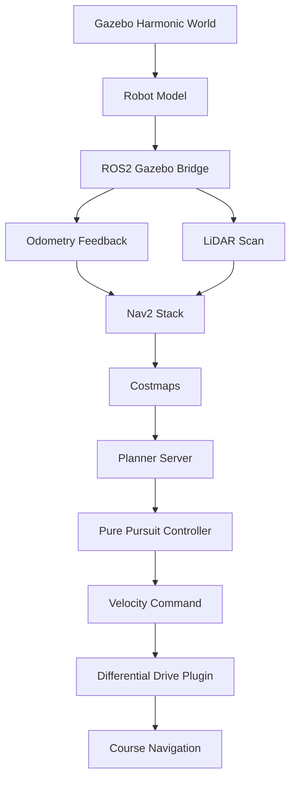

# Autonomous Navigation Simulation (Gazebo)

## Overview

A Gazebo autonomous navigation simulation built to develop, evaluate and benchmark autonomous robot navigation within structured simulation environments. The project incrementally expands from fundamental navigation scenarios to increasingly complex environments while emphasizing reproducible development, modular system design and performance evaluation.

The simulation utilizes ROS 2, Gazebo Harmonic and a custom differential drive robot to develop autonomous navigation behaviors that will ultimately be validated across multiple navigation scenarios using quantitative performance metrics. The final project will provide a Dockerized, reproducible simulation environment suitable for experimentation, parameter tuning and navigation benchmarking.

## Latest Release: v0.2
**Turn Navigation**

Version 0.2 builds on the straight corridor baseline by introducing a 90° curved corridor and full Nav2 integration, allowing the robot to autonomously navigate a multi-segment course (straight approach, curve, exit straight) using waypoint-guided path following with real-time obstacle avoidance via LiDAR.

**Key Features:**

- Nav2 bringup (controller server, planner server, behavior server, costmaps, BT navigator)
- ROS↔Gazebo TF bridge for full transform tree (`odom → base_footprint → base_link → lidar_link/caster_link`)
- Waypoint-based course navigation derived from actual obstacle geometry
- Tuned Regulated Pure Pursuit controller for smooth curve tracking
- Local/global costmap obstacle avoidance using LiDAR scan data
- RViz2 visualization with saved camera and display configuration

## Demo

  

  <em>Figure 1. Straight corridor simulation environment demonstrating baseline autonomous navigation..</em>

  

  <em>Figure 2. Turn navigation simulation environment demonstrating autonomous Nav2 guided navigation through a curved corridor.</em>

## Features

- Configurable Gazebo Harmonic test environments, including a straight corridor and a curved 90° course, both defined by traffic cone obstacles.
- Custom differential drive robot model with realistic odometry, 2D LiDAR and full TF tree support.
- Dual navigation modes: scripted odometry-based motion for baseline testing, and full Nav2 autonomous navigation for complex courses.
- Real-time obstacle avoidance via LiDAR-fed local and global costmaps.
- Waypoint navigation paths aligned with obstacle geometry to guide autonomous traversal through custom navigation courses.
- Tuned Regulated Pure Pursuit controller for smooth, overshoot-free curve tracking.
- RViz2 visualization with preconfigured camera views and display layouts for quick inspection.
- Modular ROS to Gazebo bridge configuration, making it straightforward to extend to new sensors, topics or world geometries.

## Test Environment

**Straight Corridor (v0.1):** Evaluates whether the robot can maintain stable forward motion through a constrained path without contacting the cone boundaries.

**Turn Navigation (v0.2):** Evaluates whether the robot can autonomously navigate a curved corridor using Nav2, tracking a 90° bend defined by cone geometry while avoiding obstacles in real time via LiDAR-fed costmaps.

## Scenario Details

| Field             | Description                                                                      |
| ----------------- | -------------------------------------------------------------------------------- |
| Scenario          | Straight Corridor / Turn Navigation                                              |
| Environment       | Gazebo Harmonic simulation                                                       |
| Obstacle Type     | Cone-defined corridor (orange traffic cones, 0.15m radius, 0.5m height)         |
| Robot Model       | Custom differential drive robot (0.4m x 0.3m x 0.1m body, 0.08m wheel radius)  |
| Navigation Method | v0.1: Scripted motion via odometry distance tracking. v0.2: Nav2 waypoint following with Regulated Pure Pursuit controller |
| Sensor Setup      | 2D LiDAR (360°, 10Hz, 0.12–10m range), wheel odometry                           |
| Goal Condition    | Robot reaches the end of the corridor/course without collision                   |

## System Architecture

## Tech Stack

- Gazebo Harmonic
- ROS 2 Jazzy
- C++
- URDF
- 2D LiDAR
- Nav2

## Version History
- **v0.1:** Straight Corridor    
- **v0.2:** Turn Navigation              

## Roadmap           
- **v0.3:** Roundabout Navigation         
- **v0.4:** Dead-End and Recovery Navigation           
- **v0.5:** Validation Benchmarking
- **v1.0:** Dockerized Reproducible Release           

## Author

Lucas Kwan