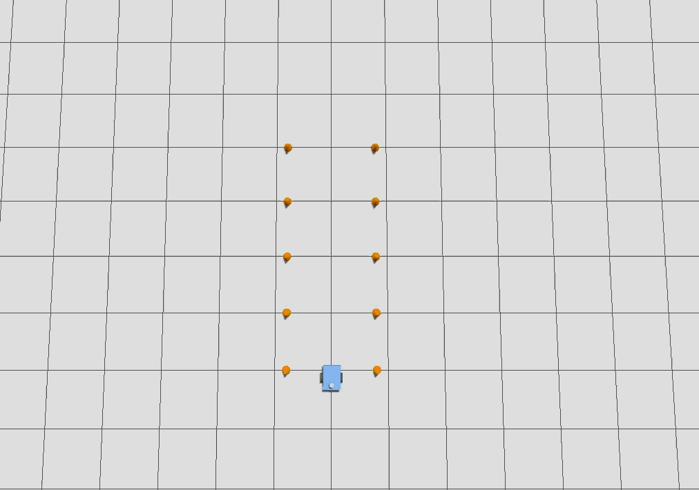
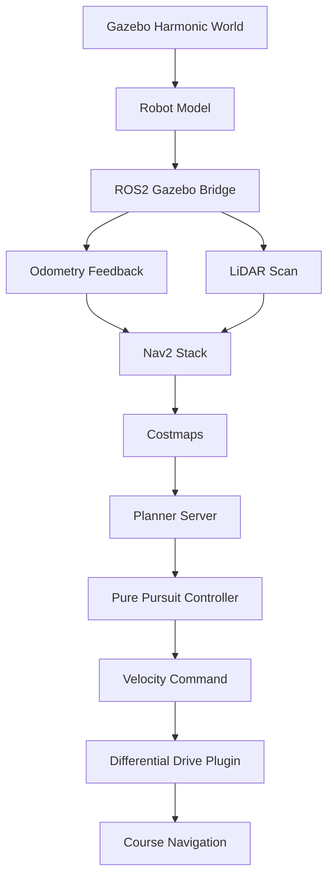

# Autonomous Navigation Simulation (Gazebo)

## Overview

A Gazebo autonomous navigation simulation built to develop, evaluate and benchmark autonomous robot navigation within structured simulation environments. The project incrementally expands from fundamental navigation scenarios to increasingly complex environments while emphasizing reproducible development, modular system design and performance evaluation.

The simulation utilizes ROS 2, Gazebo Harmonic and a custom differential drive robot to develop autonomous navigation behaviors that will ultimately be validated across multiple navigation scenarios using quantitative performance metrics. The final project will provide a Dockerized, reproducible simulation environment suitable for experimentation, parameter tuning and navigation benchmarking.

## Latest Release: v0.4
**Validation Benchmarking**

Version 0.4 introduces quantitative performance evaluation across all navigation scenarios. Each course is evaluated over ten repeated trials using Gazebo ground-truth position data, allowing navigation accuracy to be measured independently of odometry drift.

**Added Features:**
- 10 trials of quantitative benchmarking across all three navigation scenarios
- Ground truth position reporting via Gazebo dynamic pose bridge, independent of odometry drift
- Euclidean exit position error measured against intended waypoint coordinates
- Navigation time recorded per run with mean and standard deviation across scenarios
- Identified odometry drift as the primary limiting factor for sustained curved navigation

## Demo

  

  <em>Figure 1. Straight corridor simulation environment demonstrating baseline autonomous navigation..</em>

  

  <em>Figure 2. Turn navigation simulation environment demonstrating autonomous Nav2 guided navigation through a curved corridor.</em>

  

  <em>Figure 3. Half roundabout simulation environment demonstrating autonomous Nav2 guided navigation through a continuous arched corridor.</em>

## Features

- Configurable Gazebo Harmonic test environments, including a straight corridor, a curved 90° course and a halfroundabout, all defined by traffic cone obstacles.
- Custom differential drive robot model with realistic odometry, 2D LiDAR and full TF tree support.
- Dual navigation modes: scripted odometry-based motion for baseline testing, and full Nav2 autonomous navigation for complex courses.
- Real-time obstacle avoidance via LiDAR-fed local and global costmaps.
- Waypoint navigation paths aligned with obstacle geometry to guide autonomous traversal through custom navigation courses.
- Tuned Regulated Pure Pursuit controller for smooth, overshoot-free curve tracking.
- RViz2 visualization with preconfigured camera views and display layouts for quick inspection.
- Modular ROS to Gazebo bridge configuration, making it straightforward to extend to new sensors, topics or world geometries.
- Quantitative benchmarking across all navigation scenarios, evaluating success rate, navigation time and exit position error over repeated trials.
- Ground truth position reporting via Gazebo dynamic pose bridge, providing accurate final position independent of odometry drift.

## Test Environment

**Straight Corridor (v0.1): Baseline Navigation**  
Evaluates whether the robot can maintain stable forward motion through a constrained path without contacting the cone boundaries.

**Turn Navigation (v0.2): Continuous Turning**  
Evaluates whether the robot can autonomously navigate a curved corridor using Nav2, tracking a 90° bend defined by cone geometry while avoiding obstacles in real time via LiDAR-fed costmaps.

**Half Roundabout (v0.3): Sustained Curved Navigation**   
Evaluates whether the robot can autonomously navigate a continuous curved arched corridor using Nav2, exposing odometry drift as a fundamental dead-reckoning limitation over longer curved courses.

## Validation Results

Each scenario was evaluated over 10 trials at an initialized velocity of 1.0 m/s. A successful run is defined as the robot remaining within the corridor while clearing the final cone pair at the course exit. Position error is measured as the Euclidean distance between the robot's ground-truth final position and the intended exit waypoint.

| Scenario | Success Rate | Avg Time (s) | Std Dev Time (s) | Avg Exit Error (m) | Std Dev Error (m) |
| -------- | ------------ | ------------ | ---------------- | ------------------ | ------------------ |
| Straight Corridor (v0.1) | 10/10 | 7.600 | 0.085 | 0.041 | 0.024 |
| Turn Navigation (v0.2) | 10/10 | 39.445 | 3.768 | 0.404 | 0.136 |
| Half Roundabout (v0.3) | 4/10 | 61.829 | 1.450 | 0.570 | 0.201 |

### Observations

As navigation complexity increased from v0.1 through v0.3, navigation performance progressively degraded. Compared to the baseline corridor, the turn-navigation scenario maintained a 100% success rate but exhibited approximately a tenfold increase in average exit-position error, while the half-roundabout further increased completion time, exit-position error, and reduced the success rate to 40%. Most unsuccessful roundabout trials traversed the majority of the course before drifting beyond the cone-defined corridor near the exit. In most failed runs, accumulated path deviation exceeded approximately 1 m from the intended trajectory only near the course exit, suggesting that navigation reliability was primarily limited by accumulated localization error during sustained curved motion rather than an inability to negotiate the course geometry.

## Simulation Configuration

| Field | Description |
|-------------------------|-------------|
| **Simulation Platform** | Gazebo Harmonic |
| **Robot Model** | Custom differential drive robot (0.4 m × 0.3 m × 0.1 m body, 0.08 m wheel radius) |
| **Navigation Speed**  | 1.0 m/s (initialized) |    
| **Navigation Method**   | v0.1: Scripted odometry-based motion.  v0.2, v0.3: Navigation2 waypoint following using the Regulated Pure Pursuit controller. |
| **Sensors**             | 2D LiDAR (360°, 10 Hz, 0.12–10 m range) and wheel odometry |
| **Environment** | Cone-defined navigation corridors constructed from orange traffic cones (0.15 m radius, 0.5 m height) |
| **Success Criterion** | Robot remains within the cone-defined corridor while clearing the final cone pair without collision. |

## System Architecture

## Tech Stack

- Gazebo Harmonic
- ROS 2 Jazzy
- C++
- URDF
- 2D LiDAR
- Nav2

## Version History
- **v0.1:** Straight Corridor Navigation   
- **v0.2:** Turn Navigation
- **v0.3:** Half Roundabout Navigation
- **v0.4:** Validation Benchmarking                 

## Roadmap                  
- **v1.0:** Dockerized Reproducible Release           

## Author

Lucas Kwan